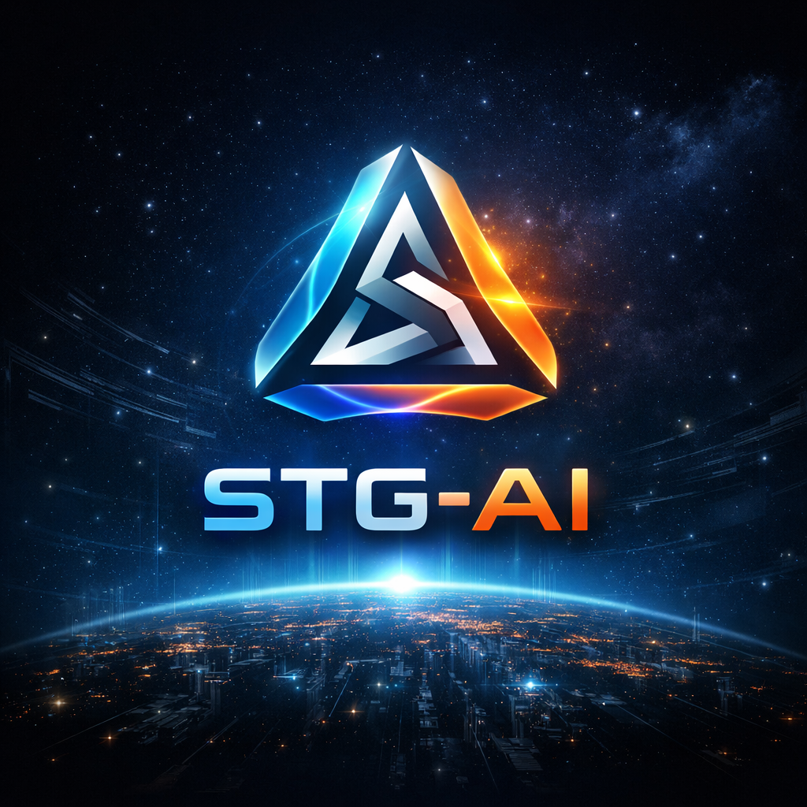

# 🎨 STG‑AI Branding Guide

## Warna Utama
| Elemen | Warna | Makna |
|--------|--------|--------|
| Biru Elektrik | `#00AEEF` | Kecerdasan dan kecepatan |
| Cyan | `#00FFFF` | Transparansi dan konektivitas |
| Oranye Energi | `#FF6A00` | Kedaulatan dan kekuatan eksekusi |
| Hitam Kosmik | `#0A0A0A` | Ketahanan dan kedalaman sistem |

## Tipografi
- **Judul:** Orbitron Bold  
- **Isi:** Roboto Regular  
- **Aksen:** Exo 2 SemiBold  

## Motif Visual
- Fraktal Tri‑Axis → simbol integrasi AI, blockchain, governance  
- Resonansi Cahaya → efek glow biru‑oranye  
- Grid Kosmik → latar dashboard holografik  

## Konsistensi
Gunakan palet dan tipografi ini di seluruh dashboard STG‑Chain (ENERGY, SUPPLY, HUMAN, PUBLIC, dll.) agar STG‑AI menjadi anchor visual utama.
